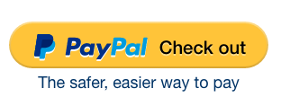
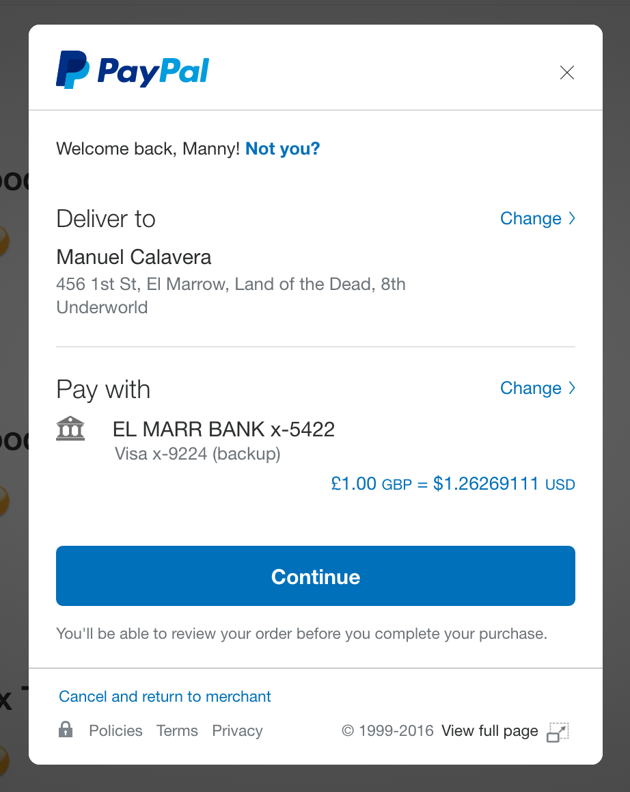

PayPal Checkout Components
--------------------------

Components allowing easy integration of PayPal Checkout into your web-site, powered by [xcomponent](https://github.com/krakenjs/xcomponent).

These components allow you to add PayPal Checkout and PayPal Buttons to your website, using both a simple and an advanced integration style depending on
the flexibility you need, and how much you need to fine-tune your checkout experience.

## Usage

Add `checkout.v4.js` to your page

```html
<script src="https://www.paypalobjects.com/api/checkout.v4.js"></script>
```

## PayPal Checkout Button



This component renders a PayPal button onto your page, which will take care of opening up PayPal for you and guiding
your customer through the payment process. After the payment is complete, we will notify you using a javascript callback
and you can take your customer to a success page.

### Simple Javascript Integration

This integration lets you specify all of your payment parameters all at once, to render a button onto the page.

We will call the `onPaymentComplete` function you define when the payment has been fully completed by the customer.

````javascript
ppxo.PayPalButton.render({

	// Pass your preferred locale, used to render the button

	locale: 'en_US',


	// Pass the payment options for your transaction

	paymentOptions: {
		merchant: 'merchant@my-paypal-enabled-business.com',
		amount: '24.99',
		currency: 'USD'
	},


	// Pass a function to be called when the customer completes the payment

	onPaymentComplete: function(data) {

		console.log('The payment was completed!');
		console.log('Token = ', data.token);
		console.log('PayerID = ', data.payerID);

		// Go to your success page
	}

}, '#myContainerElement');
````

You can also drop PayPal buttons inline on your page, using `React`, `Angular`, or with a simple `<script>` tag:

#### Script Element

```html
<div class="myCart">
	<p>Buy <strong>Full Body Lobster Onesie - $24.99</strong> now!</p>

	<script type="application/x-component" data-component="paypal-button">
		{
			// Pass your preferred locale, used to render the button

			locale: 'en_US',


			// Pass the payment options for your transaction

			paymentOptions: {
				merchant: 'merchant@my-paypal-enabled-business.com',
				amount: '24.99',
                currency: 'USD'
			},


			// Pass a function to be called when the customer completes the payment

			onPaymentComplete: function(data) {

				console.log('The payment was completed!');
				console.log('Token = ', data.token);
				console.log('PayerID = ', data.payerID);

				// Go to your success page
			}
		}
	</script>

</div>
```

#### React Element

```javascript
var MyCartComponent = window.React.createClass({
	render: function() {

		var paymentOptions = {
			merchant: 'merchant@my-paypal-enabled-business.com',
			amount: '24.99',
			currency: 'USD'
		}

		function onPaymentComplete(data) {
			console.log('The payment was completed!');
			console.log('Token = ', data.token);
			console.log('PayerID = ', data.payerID);

			// Go to your success page
		}

		return (<div className='shoppingCart'>
			<p>Buy <strong>Full Body Lobster Onesie - $24.99</strong> now!</p>

			<ppxo.PayPalButton.React locale='en_US' paymentOptions={paymentOptions} onPaymentComplete={onPaymentComplete} />

		</div>);
	}
});
```

#### Angular Element

```javascript
myapp.controller('cartController', function($scope) {

	$scope.paymentOptions = {
		merchant: 'merchant@my-paypal-enabled-business.com',
		amount: '24.99'
	}

	$scope.onPaymentComplete = function(data) {
		console.log('The payment was completed!');
		console.log('Token = ', data.token);
		console.log('PayerID = ', data.payerID);

		// Go to your success page
	}
});
```

```html
<div class="shoppingCart" ng-controller="cartController">
	<p>Buy <strong>Full Body Lobster Onesie - $24.99</strong> now!</p>

	<paypal-button locale='en_US' paymentOptions="paymentOptions" onPaymentComplete="onPaymentComplete"></paypal-button>

</div>
```


### Advanced Javascript Integration (Express-Checkout)

This integration uses [Express Checkout](https://developer.paypal.com/docs/classic/express-checkout/integration-guide/ECGettingStarted/),
which is more useful for advanced integrations.

Unlike the simple integration, you will be responsible for calling PayPal's
[Express Checkout](https://developer.paypal.com/docs/classic/express-checkout/integration-guide/ECGettingStarted/) api to set up the
transaction and create an express-checkout token, and to finalize the transaction once your customer has approved the payment.

We will call the `getToken` function you provide, in which you are responsible for calling [SetExpresscheckout](https://developer.paypal.com/docs/classic/api/merchant/SetExpressCheckout_API_Operation_NVP/)
to retrieve an express-checkout token, and passing it back to the `callback`. Then once the payment has been authorized, we will call the `onPaymentAuthorized`
function you provide, and you will be responsible for calling [DoExpressCheckoutPayment](https://developer.paypal.com/docs/classic/api/merchant/DoExpressCheckoutPayment_API_Operation_NVP/)
to finalize the transaction.


```javascript
ppxo.PayPalButton.render({

	// Pass your preferred locale, used to render the button

	locale: 'en_US',


	// Pass a function which will retrieve the express checkout token for the transaction

	getToken: function(callback) {

		// Make an ajax call to get the express-checkout token. This should call your back-end, which should invoke
		// the PayPal SetExpressCheckout api to retrieve the token.
		//
		// See https://developer.paypal.com/docs/classic/api/merchant/SetExpressCheckout_API_Operation_NVP/

		$.post('/my-api/set-express-checkout')

			// Handle the success case by passing the token to the callback

			.done(function(data) {
				callback(null, data.token);
			})

			// Handle the error case by passing the error to the callback

			.fail(function(err) {
				callback(err);
			});
	},


	// Pass a function to be called when the customer approves the payment

	onPaymentAuthorized: function(data) {

		console.log('The payment was authorized!');
		console.log('Token = ', data.token);
		console.log('PayerID = ', data.payerID);

		// At this point, the payment has been authorized, and you will need to call your back-end to complete the
		// payment. Your back-end should invoke the PayPal DoExpressCheckoutPayment api to finalize the transaction.
		//
		// See https://developer.paypal.com/docs/classic/api/merchant/DoExpressCheckoutPayment_API_Operation_NVP/

		$.post('/my-api/do-express-checkout');

			.done(function(data) {
				 // Go to a success page
			})

			.fail(function(err) {
				// Go to an error page
			});
	}

}, '#myContainerElement');
```


## PayPal Checkout



This component immediately opens PayPal on your page, and guides your customer through th epayment process. After the
payment is complete, we will notify you using a javascript callback and you can take your customer to a success page.

### Simple Javascript Integration

This integration lets you specify all of your payment parameters all at once, to initialize the checkout flow.

We will call the `onPaymentComplete` function you define when the payment has been fully completed by the customer.

```javascript
ppxo.PayPalCheckout.render({

	// Pass your preferred locale, used to render the checkout flow

	locale: 'en_US',


	// Pass the payment options for your transaction

	paymentOptions: {
		merchant: 'merchant@my-paypal-enabled-business.com',
		amount: '24.99',
		currency: 'USD'
	},


	// Pass a function to be called when the customer completes the payment

	onPaymentComplete: function(data) {

		console.log('The payment was completed!');
		console.log('Token = ', data.token);
		console.log('PayerID = ', data.payerID);

		// Go to your success page
	}

});
```


### Advanced Javascript Integration (Express-Checkout)

Unlike the simple integration, you will be responsible for calling PayPal's
[Express Checkout](https://developer.paypal.com/docs/classic/express-checkout/integration-guide/ECGettingStarted/) api to set up the
transaction and create an express-checkout token, and to finalize the transaction once your customer has approved the payment.

We will call the `getToken` function you provide, in which you are responsible for calling [SetExpresscheckout](https://developer.paypal.com/docs/classic/api/merchant/SetExpressCheckout_API_Operation_NVP/)
to retrieve an express-checkout token, and passing it back to the `callback`. Then once the payment has been authorized, we will call the `onPaymentAuthorized`
function you provide, and you will be responsible for calling [DoExpressCheckoutPayment](https://developer.paypal.com/docs/classic/api/merchant/DoExpressCheckoutPayment_API_Operation_NVP/)
to finalize the transaction.


```javascript
ppxo.PayPalCheckout.render({

	// Pass your preferred locale, used to render the checkout flow

	locale: 'en_US',


	// Pass a function which will retrieve the express checkout token for the transaction

	getToken: function(callback) {

		// Make an ajax call to get the express-checkout token. This should call your back-end, which should invoke
		// the PayPal SetExpressCheckout api to retrieve the token.
		//
		// See https://developer.paypal.com/docs/classic/api/merchant/SetExpressCheckout_API_Operation_NVP/

		$.post('/my-api/set-express-checkout')

			// Handle the success case by passing the token to the callback

			.done(function(data) {
				callback(null, data.token);
			})

			// Handle the error case by passing the error to the callback

			.fail(function(err) {
				callback(err);
			});
	},


	// Pass a function to be called when the customer approves the payment

	onPaymentAuthorized: function(data) {

		console.log('The payment was authorized!');
		console.log('Token = ', data.token);
		console.log('PayerID = ', data.payerID);

		// At this point, the payment has been authorized, and you will need to call your back-end to complete the
		// payment. Your back-end should invoke the PayPal DoExpressCheckoutPayment api to finalize the transaction.
		//
		// See https://developer.paypal.com/docs/classic/api/merchant/DoExpressCheckoutPayment_API_Operation_NVP/

		$.post('/my-api/do-express-checkout');

			.done(function(data) {
				 // Go to a success page
			})

			.fail(function(err) {
				// Go to an error page
			});
	}

});
```

## Legacy Integrations

All of the [legacy integration patterns](https://developer.paypal.com/docs/classic/express-checkout/in-context/integration/)
for PayPal Checkout will continue to work with this script.
