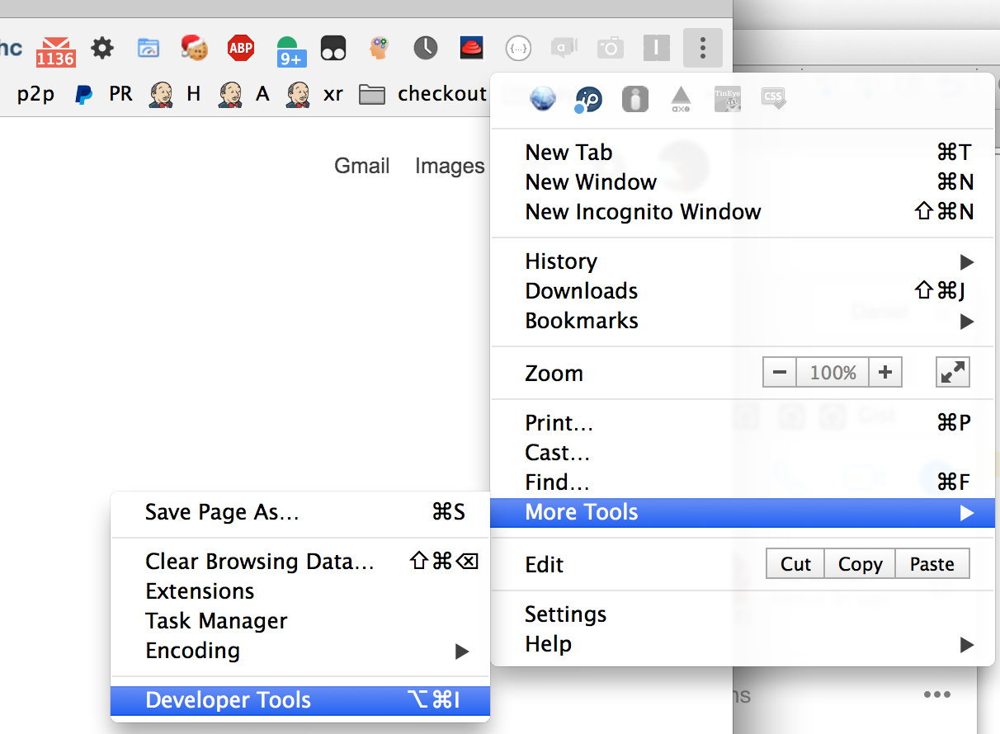
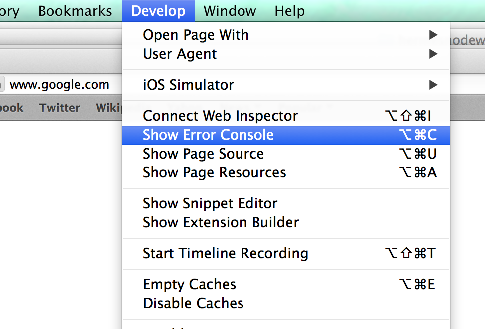
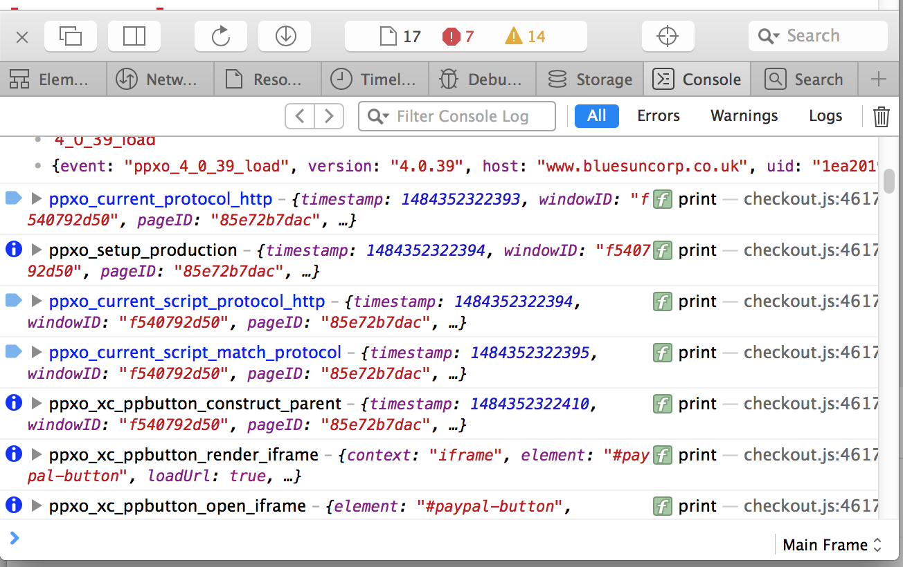
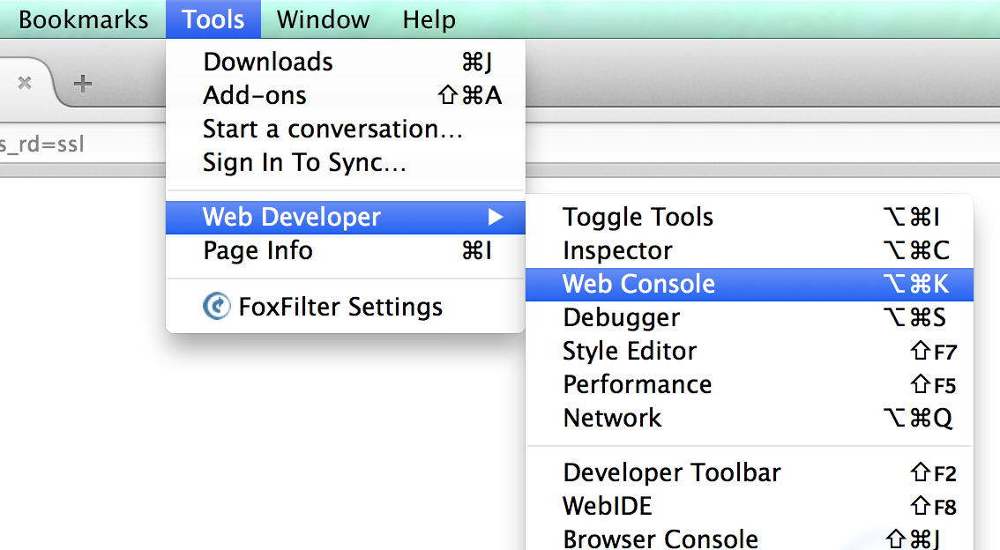
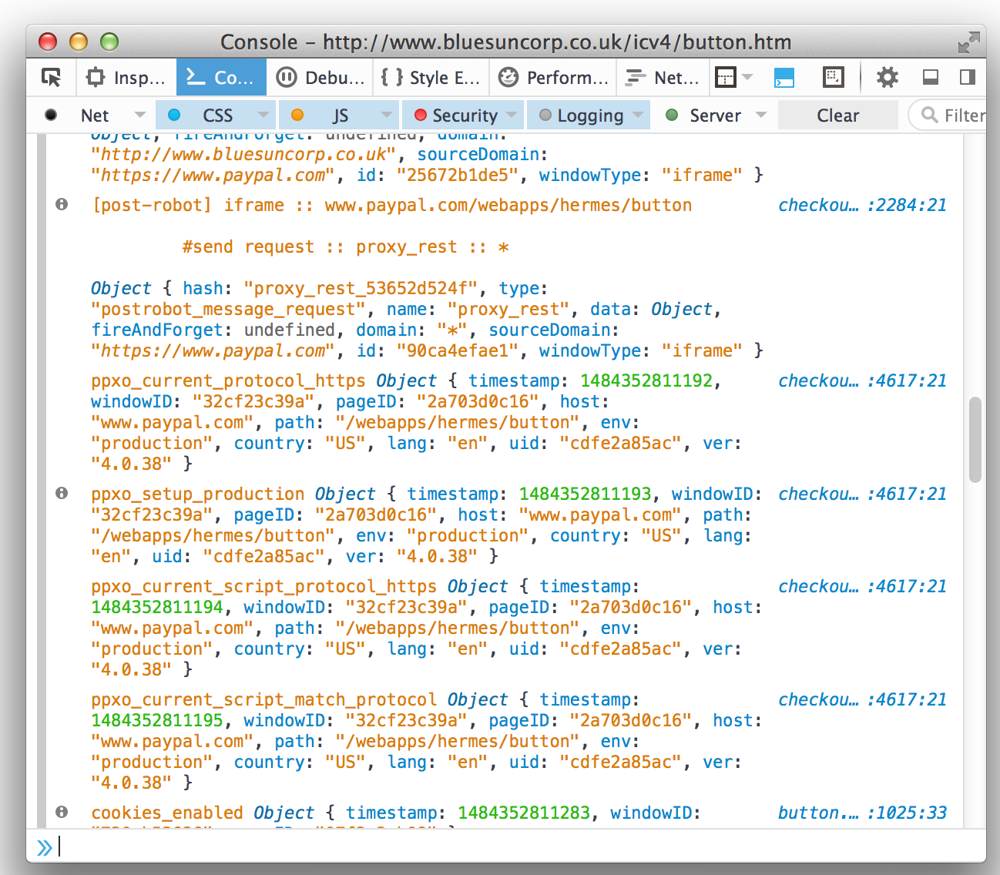
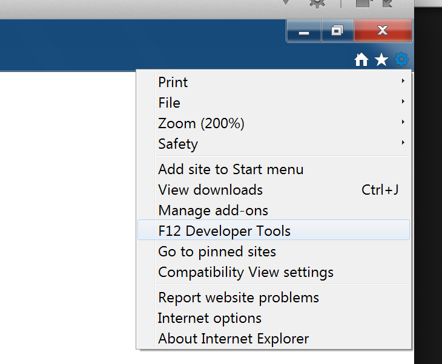
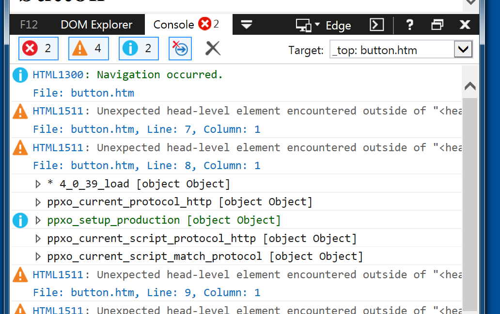

# Debugging PayPal Checkout

The following guide explains common ways to debug PayPal Checkout integrations

## Keep your dev console open

PayPal Checkout logs a lot of information to the browser console. You may see errors or useful logs here to help track
down issues with your integration.

All logs from the popup window will automatically appear in the console for the **parent window**. But in certain
browsers, logs will only start appearing after the dev tools are opened for the first time. So remember to **keep the
dev tools open at all times when debugging**.

> **Note:** Always include the **full** set of console logs when raising any issue or bug with `paypal-checkout`.

### Chrome

### Safari

### Firefox

### Internet Explorer

