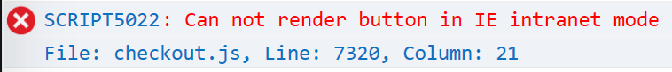
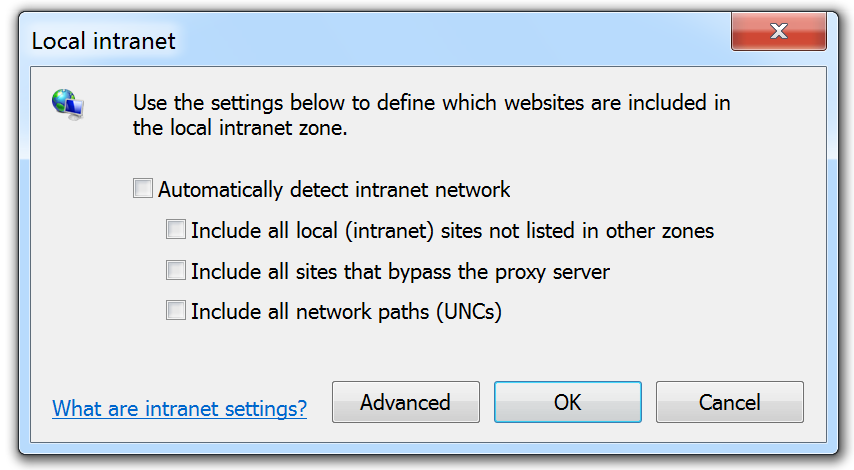

# IE Intranet and Trusted Mode

Neither the PayPal Button nor Checkout components are able to run in IE intranet or trusted mode.

This is because these modes cripples the script from interfacing correctly with iframes and popup windows. Presumably this is some well thought out security measure, which mysteriously no other browsers implement.

## Detecting Intranet mode

Open up your developer tools in IE, and check for the following error in the console:



You can also detect in code when it's not possible to render PayPal, and provide a fall-back experience:

```javascript
if (!paypal.isEligible()) {
    // Do not show PayPal experience
}
```

## Disabling intranet mode in IE settings

Load up internet options in IE:


Navigate to the security panel, make sure the Enable Protected Mode is disabled. Select 'Local intranet' then click on the 'Sites' button:


Make sure all of the options on this panel are disabled, then click on the 'Advanced' Button



Remove any websites from the list:


Repeat for 'trusted' sites:


## Escaping from IE intranet mode with /etc/hosts

Sometimes it's not possible to change IE settings due to admin policies, or the above steps don't work because IE is a voodoo entity which rarely exhibits any kind of rational behavior.

In this case you may be able to trick IE into allowing your site out of intranet hell, by modifying your `/etc/hosts` file.

In windows this is located in the convenient location: `C:\Windows\System32\Drivers\etc\hosts`

Add an entry for your site's IP address, like:

```bash
10.0.0.1    mysite-alias.com
```

Now, hopefully when you load up `http://mysite-alias.com` in IE, it won't be detected as an intranet site.
