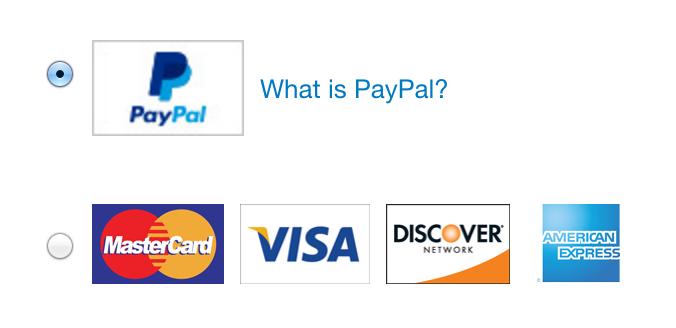

## PayPal Checkout Mark Integrations

It's possible to use PayPal Checkout as part of a Mark integration. There are a few different flavors of Mark integration
that we support. We recommend showing the PayPal Button conditionally when the PayPal radio field is selected.

### Showing the PayPal Button conditionally (recommended)

You may want a mark integration where the PayPal Button is only shown when the PayPal radio field is selected. This is
our recommended approach.

In this case you should use the [PayPal Button](./button.md) component.

1. Set up the html for your radio fields
2. Render the PayPal Button in advance onto your page using the instructions for the [PayPal Button](./button.md)
3. Use javascript to show the button container when the user selects the PayPal radio field
4. Use javascript to hide the button container when the user selects any other radio field

### Using a single button with different checkout flows

You may want a mark integration where you have a single button to checkout, and the behavior on click of the button is
determined by which radio field is selected.

In this case you should use the [PayPal Checkout](./checkout.md) component.

1. Set up the html for your radio fields and custom checkout button
2. On click of the custom checkout button, check which radio field is selected
3. If the selected radio field is PayPal, launch the [PayPal Checkout](./checkout.md) component
4. If the selected radio field is not PayPal, launch the appropriate alternative checkout flow

### Opening PayPal Checkout on click of the radio field

You may want a mark integration where the user is directed to PayPal when they click on the radio button for PayPal.

In this case you should use the [PayPal Checkout](./checkout.md) component.

1. Set up the html for your radio fields
2. On click of the PayPal radio field, launch the [PayPal Checkout](./checkout.md) component
3. On click of any other radio field, launch the appropriate alternative checkout flow
